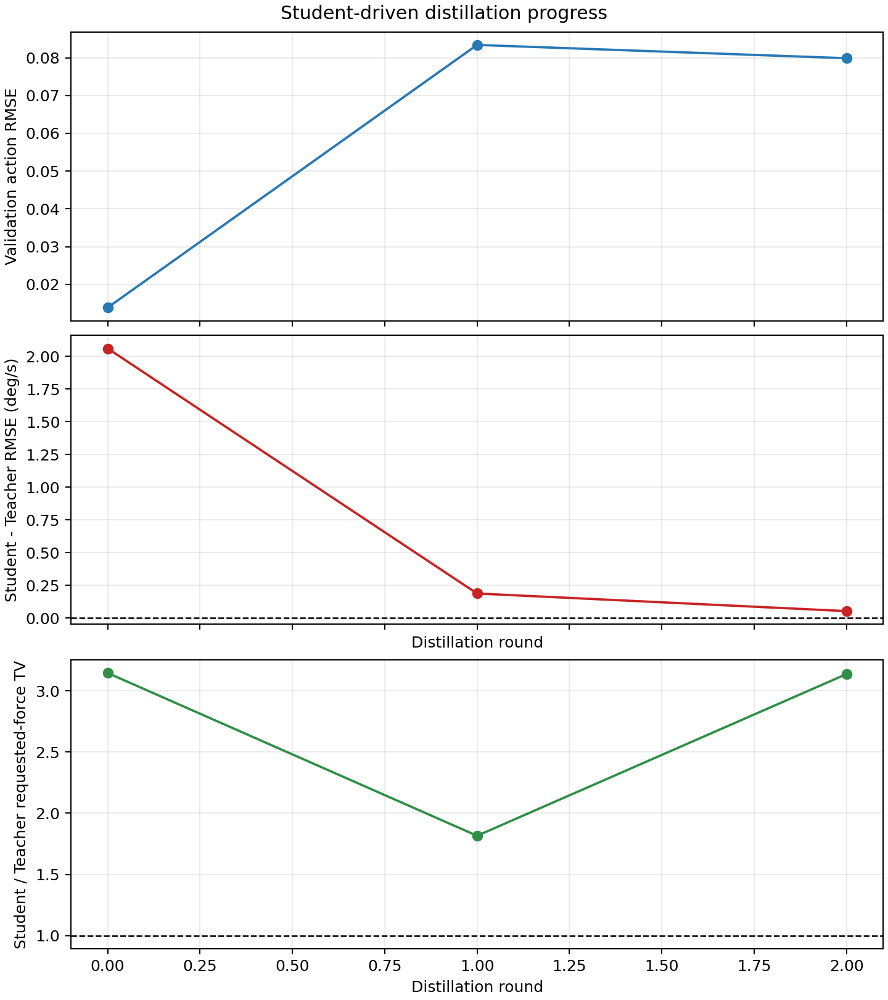

# 当前代码与实验结果快照（2026-08-30）

> 本文冻结 v3 结果。稳定性损失、困难样本加权、重新选型及最新未见飞机结果见
> [稳定性感知 v4 实验报告](stability_aware_v4_results_20260830.md)。

分支：`experiment/student-driven-v3-20260830`

本文件记录当前工作区的控制定义、主要代码、Teacher/Student 训练过程、时域结果和已知失败项。
所有结论均对应本分支提交的 JSON、CSV、模型和图片，不把“训练跑完”等同于“质量门禁通过”。

## 1. 当前结论

当前已经走通下面这条完整链路：

```text
固定 P-channel 飞机群
        |
        v
每架飞机一个纯奖励 TD3 Teacher（无 PID 示范、无 PID 控制先验）
        |
        v
32 个质量合格 Teacher
        |
        v
Teacher-driven 初始化数据
        |
        v
Student-driven / DAgger 两轮聚合
        |
        v
一个 540,417 参数 Dense Student pi(o, theta)
        |
        v
6 架整机 holdout + 10 架完全未见飞机闭环评测
```

最终 Student 已经不是“记住一条阶跃曲线”：训练包含 step、doublet、sine、multisine 和连续随机
指令，Student 同时读取控制状态与飞机参数 `theta`。它在完全未见飞机上相对 Raw 明显有效，但仍
落后于逐机 PID，且存在大指令持续振荡与 requested force 抖动。因此当前准确状态是：

```text
闭环泛化成立（相对 Raw）
        +
Student-driven 蒸馏显著改善 v2
        +
最终质量门禁未通过（峰值误差、动作平滑性）
```

不应把当前结果写成“已经优于传统 PID”或“已经满足完整 GJB 横航向品质要求”。

## 2. 控制问题定义

当前只研究单输入单输出的滚转角速度通道：

```text
p_c -> Reference Model -> p_ref
                         |
                         v
                 RL policy pi(o, theta) -> requested F_as
                                               |
                                               v
                          rate limit -> transport delay -> G_theta(s) -> p
                                                                        |
                                                                        +-- feedback
```

- 对象更新周期：`0.001 s`。
- 策略更新周期：`0.020 s`，即每个策略动作包含 20 个对象子步。
- Reference Model：二阶模型，`omega_n = 2.0 rad/s`、`zeta = 0.7`。
- Reference 保留与对象相同的纯运输延迟 `tau_p`，不惩罚物理上无法消除的延迟段。
- Action：完整的 `F_as`，不是 PID 上叠加的残差；幅值限制为 `[-22, 22] N`，变化率限制为
  `88 N/s`。
- `245 N`、`476 N` 一类结果是整段 requested force 的总变差
  `sum(abs(u[t] - u[t-1]))`，不是某一时刻输出了 245 N。

### Reward

环境即时奖励仍保持可解释的三项结构：

```text
r_t = -50 * [
    1.00 * normalized_tracking_error^2 * dt
  + 0.02 * normalized_applied_force^2 * dt
  + 0.02 * normalized_requested_force_jump^2
]
```

第三项是每次策略决策的跳变量代价，不再乘 `dt`，否则在 20 ms 控制周期下会被削弱 50 倍。
峰值误差、振荡、requested force TV 和 GJB 相关量主要作为完整轨迹评测与门禁，而不是把复杂
峰谷算法直接塞进逐步 reward。

### Teacher 和 Student 看见什么

本轮纯奖励 Teacher 的 Actor observation 为固定 35 维：

- 4 个瞬时量：`p_c, p_ref, p, p_ref-p`；
- 4 个控制状态：积分误差、`p_dot`、上一 requested force、`p_ref_dot`；
- 2 个执行机构量：commanded force、applied force；
- 25 个更早的 requested-action lag；连同“上一 requested force”共覆盖 26 个动作时刻，即
  `0.52 s`，超过当前飞机库最大 `tau_p = 0.498005 s`。

这里没有 `[p(t-k:t), u(t-k:t)]` 形式的原始观测窗口，也没有 GRU/TCN。动作队列是为了解决纯
时延导致的部分可观测性：策略需要知道哪些旧动作还在路上。每个专用 Teacher 不读取 `theta`；
唯一 Student 额外读取归一化的 8 维对象参数：

```text
[l_fa, lambda_s, t_r, zeta_d, omega_d, r_omega, r_zeta, tau_p]
```

## 3. 主要代码

| 路径 | 作用 |
| --- | --- |
| `basic/plant.py` | 8 参数 P-channel 传递函数类和直接力输入时域响应 |
| `basic/pid_plant.py` | 早期单对象 PID 闭环对照 |
| `basic/moe_td3.py` | 早期 TCN-MoE 残余阻尼原型，仅作历史诊断 |
| `src/aircraft/p_channel.py` | 正式 P-channel 状态更新与运输延迟 |
| `src/envs/reference_model.py` | 带匹配延迟的二阶 Reference Model |
| `src/envs/roll_rate_commands.py` | step/doublet/sine/multisine/连续随机指令生成 |
| `src/envs/specialist_tracking_env.py` | 35 维 observation、执行机构、reward 与轨迹记录 |
| `src/teacher/td3/` | 确定性 Actor、双 Critic、target 网络和 TD3 更新 |
| `src/teacher/specialist/pure_td3_trainer.py` | 单飞机纯奖励 Teacher 训练和质量门禁 |
| `scripts/47_train_pure_reward_teacher_bank.py` | 多飞机 Teacher Bank 训练入口 |
| `src/distillation/student_driven.py` | Teacher 初始化 + Student-driven DAgger 聚合及可验证续训 |
| `src/student/dense/` | 条件 Dense Student，输入 `observation + theta` |
| `src/student/moe/` | theta-routed MoE Student 实现和诊断能力 |
| `scripts/34_distill_student_driven.py` | 独立蒸馏、质量门禁、`--resume` 入口 |
| `scripts/48_evaluate_unseen_student.py` | 冻结 Student 的完全未见飞机评测 |
| `scripts/49_select_teacher_coverage.py` | 按品质单元和参数距离选 Teacher 候选 |
| `scripts/50_merge_teacher_banks.py` | 合并并校验 Teacher Bank |
| `scripts/51_select_distillation_holdout.py` | 选择品质覆盖的整机 holdout |
| `scripts/52_compare_unseen_students.py` | 在完全相同目标与命令上比较两版 Student |

`src/distillation/student_driven.py` 的续训逻辑会校验配置、dataset hash、checkpoint hash 和闭环
evaluation hash；不允许把不匹配的旧轮次静默当作有效输入继续训练。

## 4. Teacher Bank

候选覆盖使用“品质区域 x 数据源 split”六个单元，每格选择 8 架，共训练 48 个新候选。选择后，
合格候选与既有合格 Teacher 合并：

| 项目 | 数值 |
| --- | ---: |
| 尝试 Teacher 数 | 68 |
| 通过质量门禁 | 32 |
| 未通过 | 36 |
| `train_core` / `train_boundary` | 17 / 15 |
| Level 1 / 2 / 3 | 9 / 14 / 9 |

候选加入后，1770 架可用飞机到最近 Teacher 的平均归一化参数距离由 `1.1062` 降至 `0.7954`；
冻结的 10 架零样本目标由 `1.0563` 降至 `0.8221`。这说明 Bank 覆盖确实变密，但最终控制效果
仍取决于 Teacher 质量和 Student 的闭环分布，不是单纯增加数量就一定改善。


## 5. Student-driven 蒸馏

使用 26 架飞机训练，6 架整机 holdout。每架飞机包含 11 条采集命令。round 0 在 Teacher 轨迹
上采集，round 1 和 round 2 由当前 Student 闭环访问状态、再由对应 Teacher 标注动作。

| Round | Driver | 累计行数 | Train / Validation | Validation action RMSE | Holdout Student RMSE (deg/s) | Student-Teacher 中位差 (deg/s) | 最大峰值误差 (deg/s) | requested-force TV (N) | TV / Teacher |
| ---: | --- | ---: | ---: | ---: | ---: | ---: | ---: | ---: | ---: |
| 0 | Teacher | 264,000 | 214,500 / 49,500 | 0.01388 | 5.8257 | 2.0590 | 47.6679 | 368.67 | 3.145 |
| 1 | Student | 528,000 | 429,000 / 99,000 | 0.08339 | **1.0788** | 0.1875 | **22.9062** | **212.84** | **1.816** |
| 2 | Student | 792,000 | 643,500 / 148,500 | 0.07987 | 1.0914 | 0.0531 | 23.8302 | 367.62 | 3.136 |

最终自动选择 round 1。round 2 的 Teacher 动作拟合差距略小，但闭环 RMSE、峰值和动作 TV 反而
变差，这正是不能只按离线 action loss 选 Student 的原因。



### 最终质量门禁

| 检查 | 阈值 | round 1 | 结果 |
| --- | ---: | ---: | --- |
| Student-Teacher RMSE 中位差 | `<= 0.5 deg/s` | `0.1875` | 通过 |
| 相对 Raw 改善率 | `>= 1.0` | `1.0` | 通过 |
| 相对 Raw 伤害率 | `<= 0.0` | `0.0` | 通过 |
| 最大峰值误差 | `<= 5 deg/s` | `22.9062` | **失败** |
| 平均 requested-force TV | `<= 360 N` | `212.84` | 通过 |
| Student / Teacher TV | `<= 1.25` | `1.816` | **失败** |

因此 `pipeline_report.json` 的正式状态是 `quality_gate_failed`，不是 `complete`。最终 checkpoint
仍被保存用于诊断，SHA-256 为：

```text
1dcbcd7114c704306309a423eb3ab11f5265c7bd50f4b3f742379cb61bf49759
```

## 6. 完全未见飞机结果

冻结 Student 后，在未参与 Teacher Bank、蒸馏或适配的 10 架飞机上测试，共 60 个飞机-命令对：

```text
core:     0387, 0452, 0596, 0867, 0925, 1167
boundary: 1578, 1592, 1717, 1798
```

| Controller | 平均 RMSE (deg/s) | 最大峰值误差 (deg/s) | 平均 requested-force TV (N) |
| --- | ---: | ---: | ---: |
| Raw | 48.3770 | 849.7530 | 145.65 |
| 逐机 PID | **1.4094** | **21.4604** | **72.20** |
| v3 Student | 2.4112 | 46.8419 | 476.64 |

- Student 相对 Raw 改善 `58/60 = 96.67%`。
- Student 胜过或追平逐机 PID `7/60 = 11.67%`。
- 未见飞机、Student checkpoint 未变、目标/已见集合无重叠等自检全部通过。
- PID 和 Student 使用相同对象、测试命令、仿真窗口与坐标；但 PID 参数来自 5 s 调参窗口，最终
  测试是 30 s，所以 Student-vs-PID 的绝对比较仍应注明“调参窗口不匹配”。


### 相对 v2 Student

在完全相同的 10 架飞机和 60 条命令上，Raw/PID 指标逐项相同，自检通过：

| 指标 | v2 Student | v3 Student |
| --- | ---: | ---: |
| 平均 RMSE (deg/s) | 4.4416 | **2.4112** |
| 最大峰值误差 (deg/s) | 103.7895 | **46.8419** |
| 平均 requested-force TV (N) | 502.33 | **476.64** |

v3 在 `51/60 = 85%` 的命令对和 `9/10 = 90%` 的飞机上改善，平均 RMSE 降低
`2.0304 deg/s`。Teacher 覆盖与 Student-driven 数据聚合有实质收益，但还没有消除动作抖动。


## 7. 时域曲线判断

当前曲线不是“全部稳定、只是数字差一点”，而是有明确的两类剩余问题：

1. `train_boundary-1448` 的 `+/-15 deg/s`、doublet、sine、multisine 基本能贴近 Reference；但
   `+25 deg/s` 在约 9 s 后进入持续振荡，requested/applied force 形成大幅周期动作。这一条直接
   解释了 holdout 的 `22.91 deg/s` 峰值门禁失败。
2. 完全未见飞机中，`boundary-1592` 表现稳定且平均优于 PID；`core-0452` 能压住 Raw 发散但在
   大阶跃长时段漂移；`core-0867` 与 `boundary-1717` 有明显高频 requested-force 抖动。


所以当前最优先的问题不是继续盲目增加 Teacher 数，而是针对 Student 访问到的高峰值/高 TV 状态
提高采样与损失权重，并在闭环选择中加入可微或轨迹级平滑、稳定性约束。

## 8. `basic/` 早期原型结果

`basic/` 保留了从 3 N 阶跃、PID 到 TCN-MoE TD3 的早期实验，便于复查思路演变。30 架验证集上，
早期 TCN-MoE 的振荡能量平均降低 `23.56%`，30/30 能量改善，峰值改善率 `93.33%`；但路由 top-1
明显集中到第 4 个专家（约 `77.15%`），而且它使用 256 个历史采样，与当前正式 35 维固定状态
合同不同。该结果只能作为残余阻尼和路由集中诊断，不能与当前 Reference tracking Student 混写。

三个早期 `.pt` checkpoint 单文件约 160 MB，超过 GitHub 普通 Git 的 100 MB 限制，本分支不提交
它们；相应代码、JSON、日志和全部曲线均提交。当前 v3 目录共 1919 个文件、约 729 MiB，最大
单文件小于 5 MiB，完整纳入本分支。两份实验所用飞机参数库和 GJB 参考 PDF 也随分支提交。

## 9. 复现与核验

核心入口：

```bash
# 单飞机纯奖励 Teacher
python scripts/41_train_pure_reward_td3.py --plant-id <id> --output <dir> \
  --steps 80000 --requested-action-history-steps 26 \
  --include-reference-derivative --device cuda

# Student-driven 蒸馏；中断后可增加 --resume
python scripts/34_distill_student_driven.py \
  --teacher-bank results/pure_reward_teacher_bank_coverage_v3/merged_bank/teacher_bank.json \
  --output results/pure_reward_teacher_bank_coverage_v3/student_driven_dense_balanced_holdout \
  --student-architecture dense --dagger-rounds 2 --device cuda

# 冻结 Student 的未见飞机评测
python scripts/48_evaluate_unseen_student.py --help

# v2-v3 同条件比较
python scripts/52_compare_unseen_students.py --help
```

本快照代码已执行完整测试：`122 passed in 400.29 s`。另外，新增/修改的 Python 文件通过
`py_compile` 和 Ruff 检查。全仓 Ruff 仍报告 18 个位于本轮未修改旧文件中的历史风格问题；不把
它们误报成本轮通过。测试证明接口、时序、hash、恢复和评测合同成立；它不替代闭环质量门禁，
后者当前仍为失败状态。

## 10. 结果索引

- Teacher Bank：`results/pure_reward_teacher_bank_coverage_v3/merged_bank/teacher_bank.json`
- 选择与覆盖：`results/pure_reward_teacher_bank_coverage_v3/selection/selection.json`
- 蒸馏总报告：`results/pure_reward_teacher_bank_coverage_v3/student_driven_dense_balanced_holdout/pipeline_report.json`
- 逐轮指标：`results/pure_reward_teacher_bank_coverage_v3/student_driven_dense_balanced_holdout/round_metrics.csv`
- 最终 Student：`results/pure_reward_teacher_bank_coverage_v3/student_driven_dense_balanced_holdout/final/dense_student.pt`
- 未见飞机报告：`results/pure_reward_teacher_bank_coverage_v3/unseen_aircraft_v3/report.json`
- v2-v3 比较：`results/pure_reward_teacher_bank_coverage_v3/unseen_comparison_v3/comparison.json`
- 每架飞机的完整时域图：`results/pure_reward_teacher_bank_coverage_v3/unseen_aircraft_v3/aircraft/`
