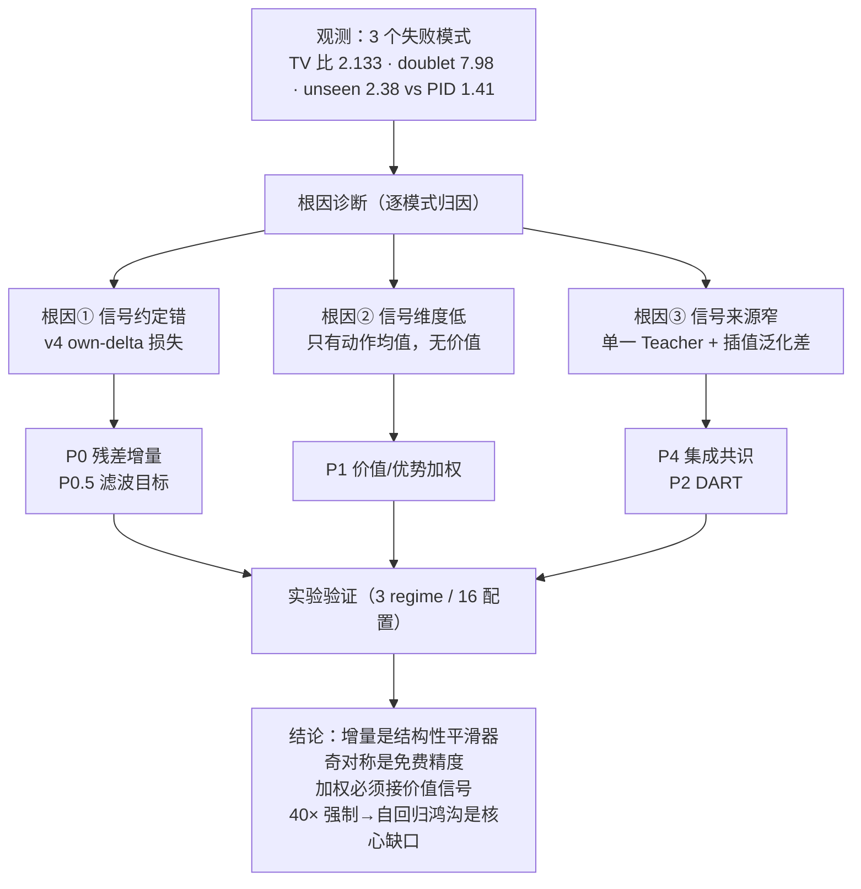
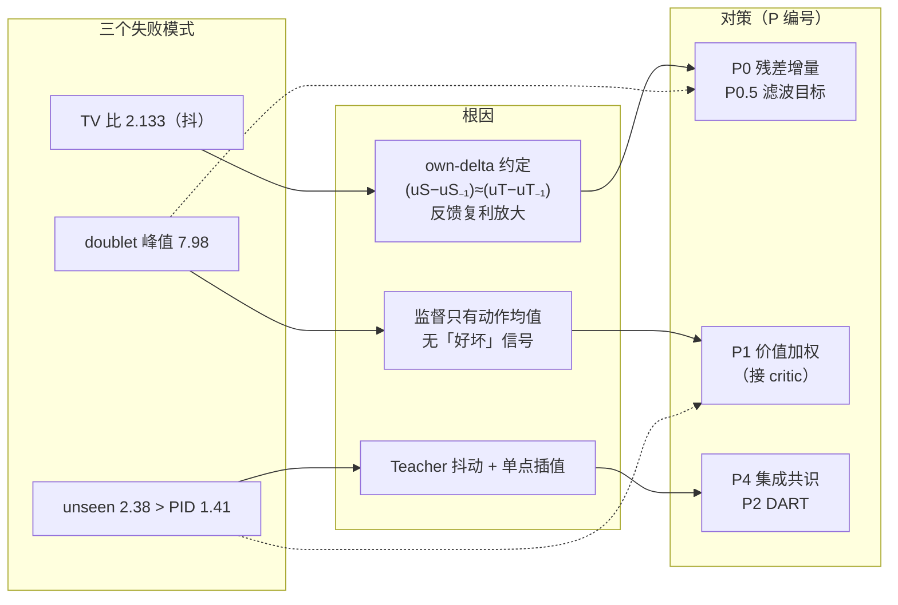
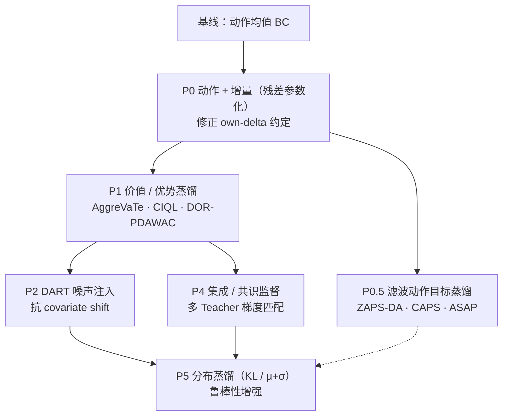
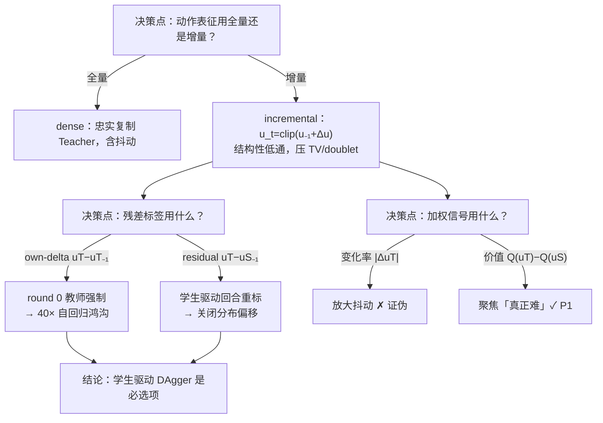
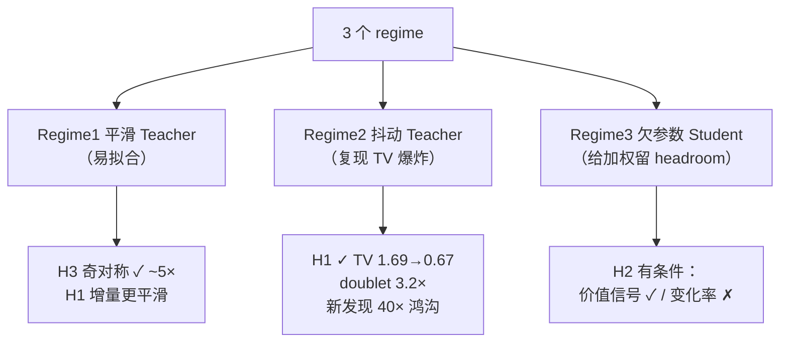
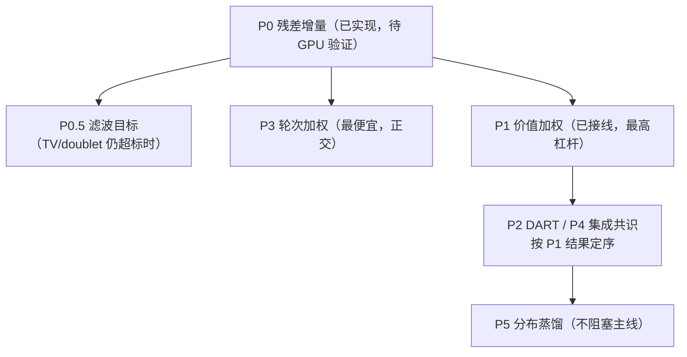

# pingmo 蒸馏方法论 · 汇总与逻辑图

> 一份把「诊断 → 文献 → 实现 → 实验 → 结论」串成思维链的浓缩索引。
> 详细论证见 `distillation_methodology_report.md`，实验代码 `experiments/distillation_ablation.py`，
> 结果 `results/ablation/*.json`。

---

## 0. 一句话定位

> **用 DAgger 保证数据在 Student 自己的分布上，用残差增量保证动作平滑，用 Teacher 价值函数保证监督信号是
> 「什么是好」而非「Teacher 做了什么」，用跨 θ 集成共识保证泛化不依赖单点插值。**

---

## 1. 思维链总览（顶层逻辑图）

---

## 2. 失败模式 → 根因 → 对策（映射逻辑图）

---

## 3. 方法论阶梯（ladder）与文献锚点

> 阶梯的递进逻辑：**信号维度**（动作→增量→分布→价值）与**信号来源**（单 Teacher→集成）两条主线正交，
> 可分别消融、组合推进。

---

## 4. 关键设计决策链（为什么这么做）

---

## 5. 实验逻辑与结论

| 假设 | 判定 | 关键数字 |
| --- | --- | --- |
| H1 增量表征降 TV | ✅ 确认 | TV 比 1.69 → 0.67；max\|Δu\| 0.266 → 0.083（3.2×） |
| H3 奇对称 | ✅ 确认且强 | 关掉后 MSE 恶化 ~5× |
| H2 优势加权 | ⚠️ 有条件 | 价值信号有效；变化率代理 TV 0.152→0.190（有害） |
| H4 hard-case | ⚪ 中性 | 合成 setup 里无效 |

---

## 6. 路线图（依赖关系）

**推荐顺序**：P0 先跑通 → 视结果插 P0.5 → P3 → P1（单变量消融对比 P0）→ P2/P4 → P5。

---

## 7. 文件与记忆索引

| 产物 | 位置 |
| --- | --- |
| 详细报告（§1–§9） | `docs/distillation_methodology_report.md` |
| 本汇总 | `docs/distillation_methodology_summary.md` |
| 实验脚本 | `experiments/distillation_ablation.py` |
| 实验结果 | `results/ablation/distillation_ablation_{smooth,jitter,capacity}.json` |
| P1 实现 | `src/distillation/critic.py`（新增）+ `dataset.py`/`distill.py`/`student_driven.py`/`scripts/34_*` |
| 冒烟测试 | `tests/test_v6_incremental_smoke.py` · `tests/test_v7_advantage_weighting_smoke.py` |
