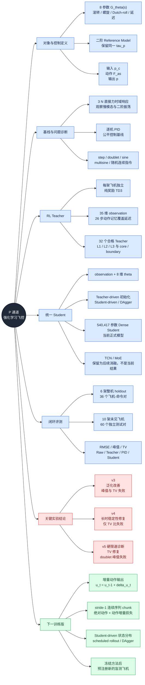

# P 通道强化学习飞控近期工作总览（截至 2026-09-01）

本文把最近完成的对象建模、传统控制对照、纯奖励 Teacher、Student-driven 蒸馏、稳定性修订和
动作限速诊断整理到一条技术主线上。它是项目的入口文档；各版本的完整配置、JSON 和逐机曲线仍
以文末链接的分报告为准。

## 1. 一页结论

当前已经走通完整的单通道研究链路：

```text
8 参数 P-channel 对象
        -> 直接力输入与 PID 时域基线
        -> 每架飞机一个纯奖励 TD3 Teacher
        -> 32 个合格 Teacher 组成 Teacher Bank
        -> Teacher-driven 初始化 + Student-driven / DAgger
        -> 一个读取 observation 与 theta 的 Dense Student
        -> 6 架整机 holdout + 10 架零样本飞机闭环评测
```

最重要的阶段结论是：

- 强化学习 Student 已经能对不同飞机形成统一控制律，并在绝大多数未见飞机命令上明显优于 Raw。
- v4 已解决 v3 最严重的长时闭环振荡，holdout 最大峰值从 `22.91` 降到 `4.76 deg/s`。
- v4 仍有 requested-force 高频修正，Student/Teacher TV 比为 `2.133`，超过门限 `1.25`。
- v5 证明固定硬限速不是正确修复：`11 N/s` 把 TV 比降到 `0.574`，却使 doublet 峰值升到
  `7.98 deg/s`。
- 当前没有一个版本通过全部质量门，也没有证据支持“Student 已优于逐机 PID”或“已完成完整
  横航向 GJB 评估”。

因此目前最有价值的下一步不是扩大网络或增加 MoE 专家，而是训练一个具备动作时间一致性的
增量动作 Student。后续训练仍以 v4 checkpoint 为基线；v5 的 `11 N/s` 包装器只保留为失败
诊断，不作为新的最佳控制器。

## 2. 思维导图



## 3. 控制问题现在如何定义

当前只研究 SISO 滚转角速度通道：

$$
G_\theta(s)=\frac{p(s)}{F_{as}(s)}
=
\frac{l_{fa}s\left(s^2+2\zeta_\phi\omega_\phi s+\omega_\phi^2\right)}
{(s-\lambda_s)(s+1/T_R)
\left(s^2+2\zeta_d\omega_d s+\omega_d^2\right)}e^{-\tau_p s}
$$

其中：

```text
theta = [l_fa, lambda_s, T_R, zeta_d, omega_d, r_omega, r_zeta, tau_p]
omega_phi = r_omega * omega_d
zeta_phi  = r_zeta  * zeta_d
```

Dutch-roll 不是额外注入的输入，而是对象二阶极点的一部分；纯延迟通过 fractional-delay/FIFO
实现为 `F_as(t - tau_p)`，不是把 `tau_p` 当作普通分子参数。

闭环控制结构为：

```text
p_c -> Reference Model -> p_ref
                         |
                         v
             pi(o, theta) -> requested F_as
                  ^                  |
                  |                  v
                  +------ p <- delay + G_theta(s)
```

| 合同 | 当前值 |
| --- | --- |
| 对象步长 | `0.001 s` |
| 策略步长 | `0.020 s`，50 Hz |
| Reference | `omega_n = 2.0 rad/s`，`zeta = 0.7`，匹配对象 `tau_p` |
| 动作 | 完整 `F_as`，范围 `[-22, 22] N` |
| 环境 commanded-force 变化率 | `88 N/s` |
| Teacher observation | 35 维，包括 26 个 requested-action 时刻，覆盖 `0.52 s` |
| Student 条件 | 同一 observation + 归一化 8 维 `theta` |

即时 reward 保持三项可解释结构：

$$
r_t=-w_e\bar e_t^2-w_u\bar u_t^2-w_{\Delta u}
(\bar u_t-\bar u_{t-1})^2
$$

完整轨迹上的 RMSE、峰值、振荡、稳定时间、requested-force TV 和 GJB 相关量用于训练后评测，
不把需要整段峰谷检测的指标硬塞进每一步 reward。

## 4. 最近工作按阶段整理

| 阶段 | 做了什么 | 得到的结论 |
| --- | --- | --- |
| 对象建模 | 建立 8 参数 `Plant` 类、任意力输入响应和 `3 N / 10 s / 0.001 s` 阶跃响应 | 时域曲线必须按对象的 Dutch-roll 周期和慢模态解释，10 s 对部分低频对象并不长 |
| 传统基线 | 建立带幅值、变化率、延迟和 anti-windup 的 PID 闭环，并测试跨飞机复用 | 单机 PID 很强，但一个飞机的 PID 直接用于另一架飞机不等价于泛化控制器 |
| RL 方案筛选 | 比较 SAC/TD3 方向，最终正式 Teacher 使用无 PID 示范的纯奖励 TD3 | RL 学到的本质仍是控制律；价值在多对象、延迟和多指令下的统一策略 |
| 指令与状态修订 | 加入连续随机 step、doublet、sine、multisine；修复 time-limit bootstrap；加入 26 步 requested-action 记忆 | 延迟队列不可见和短窗口截断确实会拖慢或破坏收敛 |
| Teacher Bank | 扩大品质区域与参数覆盖，最终保留 32 个通过门禁的专用 Teacher | Teacher 数量有用，但覆盖密度不能替代 Teacher 质量和 Student 闭环验证 |
| v3 Student-driven | 26 架训练、6 架整机 holdout；Teacher 初始化后做两轮 Student-driven / DAgger | 相比早期 Student 泛化明显改善，但峰值与动作平滑性同时失败 |
| v4 稳定性蒸馏 | 加入合法时间前驱、动作增量匹配、困难样本加权和稳定性优先选型 | 修复最严重长时振荡；峰值门通过，只剩 Student/Teacher TV 比失败 |
| v5 限速诊断 | 仅用训练飞机选 `11 N/s`，冻结后测试 holdout 和未见飞机 | 固定限速降低 TV，却损伤快速动作反转；不能作为最终修复 |

## 5. Teacher 与 Student 当前结构

### Teacher

- 一架飞机对应一个独立 Teacher，Teacher 不需要读取 `theta`。
- 正式 Teacher 是纯奖励 TD3，不使用 PID 行为克隆，也不在部署时调用 PID。
- 项目最初按 SAC 梳理了状态、动作和 reward；算法对照后当前正式 Teacher 改用 TD3，但
  Reference、环境和评测合同不依赖 SAC/TD3 的名称。
- Actor observation 为 35 维；Critic 训练时可以读取对象状态、延迟 FIFO 和命令上下文等
  privileged information，但这些量不进入部署 Actor。
- 训练覆盖 step、doublet、sine、multisine 和连续随机命令，而不是记忆单一 `30 deg/s` 阶跃。

Teacher Bank 的最终组成：

| 项目 | 数量 |
| --- | ---: |
| 合格 Teacher | 32 |
| `train_core / train_boundary` | 17 / 15 |
| `Level 1 / Level 2 / Level 3` | 9 / 14 / 9 |


### Student

当前正式部署模型是一个 `540,417` 参数 Dense Student：

```text
observation(35) + normalized theta(8)
                  |
                  v
          Dense Student pi(o, theta)
                  |
                  v
       normalized full F_as in [-1, 1]
```

蒸馏首轮由 Teacher 驱动；后续轮次由 Student 闭环访问状态，再由对应 Teacher 标注。这就是这里的
Student-driven / DAgger，而不是“只离线复制 Teacher 曲线”。

TCN、GRU 和 theta-routed MoE 已做过原型或能力诊断，但当前正式 v4/v5 结果没有使用它们。当前
失败首先是动作时序一致性，不应通过增加专家数量掩盖。

## 6. v3、v4、v5 的核心结果

### 六架整机 holdout，36 个飞机-命令对

| 版本 | 平均 RMSE (deg/s) | 最大峰值 (deg/s) | 平均 Student TV (N) | TV / Teacher | 质量门状态 |
| --- | ---: | ---: | ---: | ---: | --- |
| v3 Student-driven | 1.0788 | 22.9062 | 212.84 | 1.816 | 峰值、TV 比失败 |
| v4 稳定性蒸馏 | **0.9457** | **4.7569** | 249.99 | 2.133 | 仅 TV 比失败 |
| v4 + v5 `11 N/s` 限速 | 1.0357 | 7.9847 | **67.30** | **0.574** | 峰值失败 |

v4 对最严重样本 `train_boundary-1448` 的修复是真实闭环改进：v3 从约 9 s 开始持续振荡，v4 在
同一 `+25 deg/s` 指令下保持稳定。


v5 的反例同样明确：`train_boundary-1605` doublet 快速反向时，硬限速使控制力来不及穿过零，
导致滚转角速度下冲，最大误差升到 `7.98 deg/s`。


### 十架未见飞机，60 个独立命令对

| Controller | 平均 RMSE (deg/s) | 最大峰值 (deg/s) | 平均 requested-force TV (N) |
| --- | ---: | ---: | ---: |
| Raw | 48.3770 | 849.7530 | 145.65 |
| 逐机 PID | **1.4094** | **21.4604** | **72.20** |
| v3 Student | 2.4112 | 46.8419 | 476.64 |
| v4 Student | **2.3784** | 47.7420 | 421.65 |
| v4 + `11 N/s` | 2.6748 | **47.5851** | **89.84** |

这张表说明了当前真实位置：Student 对 Raw 的改善已经成立，但与专用 PID 仍有明显差距；固定
限速可以把 TV 拉到接近 PID，却以跟踪性能退化为代价。

## 7. 已经确认与尚未确认的边界

已经确认：

- 一架飞机一个纯奖励 RL Teacher 可以学出专用 P 通道控制律。
- Student 读取 `theta` 后能够统一多个 Teacher，并对未见对象产生非平凡的零样本控制效果。
- Reference tracking、动作幅值和动作变化三类目标必须同时存在，只惩罚振荡会产生“不动作”的
  奖励漏洞。
- 延迟动作记忆、连续随机指令和 Student-driven 状态采集都是必要工程条件。
- 离线 action MSE 不能替代闭环 RMSE、峰值和 TV 门禁。

尚未确认：

- 当前 Student 尚未通过全部 holdout 质量门。
- 当前 Student 尚未整体达到或超过逐机 PID。
- 现有模型只支持 `p/F_as` SISO 通道，不能完整评估需要 `beta`、`r` 或横向加速度的 GJB 指标。
- 反复使用的 10 架“未见飞机”现在更适合作为固定回归集，不再是严格意义上的最终盲测集。
- 当前结果不能直接外推到六自由度、真实执行机构或实机安全认证。

## 8. 下一步实施方案

下一训练版保持 Teacher Bank、Reference、reward、命令集和 Dense 主干不变，只改 Student 的时间
建模方式，以保证因果归因清楚。

### 8.1 增量动作 Student

将每步独立输出完整动作：

$$
u_t=\pi(o_t,\theta)
$$

改为：

$$
\Delta u_t=\pi_\Delta(o_t,\theta,u_{t-1}),\qquad
u_t=\operatorname{clip}(u_{t-1}+\Delta u_t,-1,1)
$$

网络仍可以在 doublet 时输出较大必要增量，但稳态小误差区不会每步重新生成互不一致的完整动作。

### 8.2 连续序列蒸馏

- 数据使用 stride-1 连续 episode chunk，不跨 episode、命令或飞机连接前驱。
- 同时优化绝对动作误差和 Teacher 动作增量误差。
- 平滑项只惩罚超过 Teacher 局部变化率加 margin 的 Student 增量，保留 Teacher 必要的快速反转。
- 在 Teacher-driven 初始化后继续采集 Student-driven 轨迹，并逐步增加 Student 自回归动作比例。

### 8.3 评测顺序

```text
训练飞机调损失与序列长度
        -> 6 架 holdout 做 RMSE / 峰值 / TV 六项门
        -> 固定方法和所有阈值
        -> 现有 10 架回归集
        -> 新预注册 untouched aircraft 最终盲测
```

只有增量 Dense Student 仍不能解决时间一致性时，才增加 causal TCN/GRU 消融；只有出现明确的
跨 `theta` 容量瓶颈时，才重新引入 MoE 路由。

## 9. 文档和结果入口

| 文档或结果 | 内容 |
| --- | --- |
| [`第一阶段_SAC控制设计.md`](第一阶段_SAC控制设计.md) | Reference、状态、动作、reward 和 GJB 边界 |
| [`current_code_and_results_20260830.md`](current_code_and_results_20260830.md) | v3 完整代码与实验快照 |
| [`stability_aware_v4_results_20260830.md`](stability_aware_v4_results_20260830.md) | v4 稳定性蒸馏、三轮结果和未见飞机对比 |
| [`student_slew_limit_diagnostic_v5_20260830.md`](student_slew_limit_diagnostic_v5_20260830.md) | v5 限速选择、holdout 反例和结论 |
| `results/pure_reward_teacher_bank_coverage_v3/merged_bank/teacher_bank.json` | 32 个合格 Teacher 的冻结清单 |
| `results/pure_reward_teacher_bank_coverage_v4/student_driven_dense_stability/pipeline_report.json` | v4 最终质量门与选型记录 |
| `results/pure_reward_teacher_bank_coverage_v5/slew_limit_holdout_validation/holdout_report.json` | v5 限速 holdout 失败报告 |

当前分支：`experiment/student-driven-v3-20260830`。最近三个关键提交为：

```text
4aefd37  pure-reward Teacher Bank 与 Student-driven v3
edb5e27  稳定性感知 Student 蒸馏 v4
58f6bb2  冻结 Student 动作限速诊断 v5
```
