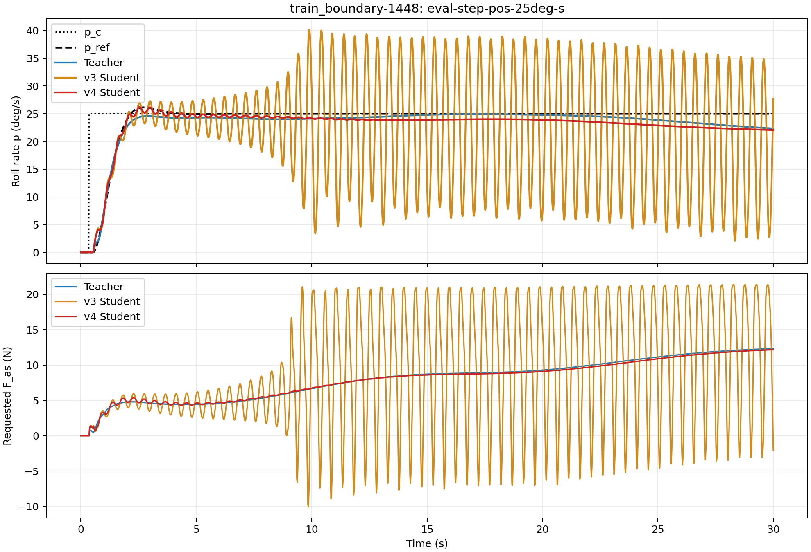
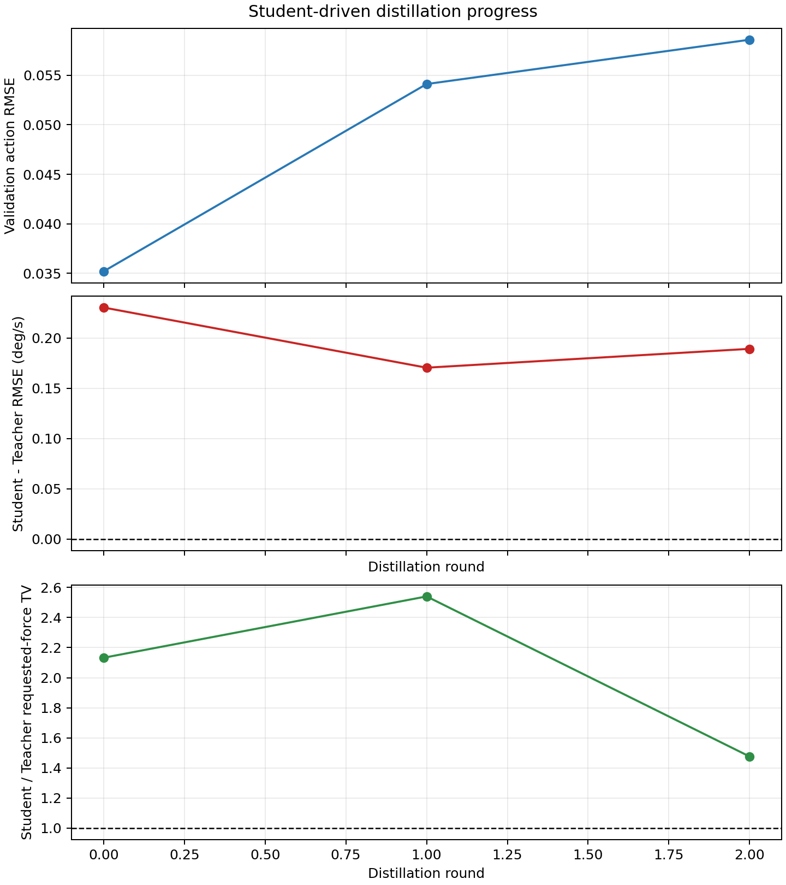

# 稳定性感知 Student 蒸馏 v4 实验报告（2026-08-30）

分支：`experiment/student-driven-v3-20260830`

本报告记录 v4 的代码、训练、闭环曲线、未见飞机评测和失败项。所有数字均来自同目录下已冻结的
JSON/CSV/checkpoint，不把“训练结束”写成“全部质量门禁通过”。

## 1. 结论

v4 解决了 v3 最明显的 holdout 长时失稳：在完全相同的 `+25 deg/s` 指令下，
`train_boundary-1448` 的 v3 Student 从约 9 s 开始持续振荡，而 v4 Student 全程保持稳定。

| 六架 holdout 的 matched `+25 deg/s` | v3 Student | v4 Student |
| --- | ---: | ---: |
| 平均 tracking RMSE | 3.0713 deg/s | **1.6869 deg/s** |
| 平均 requested-force TV | 426.04 N | **19.06 N** |
| `boundary-1448` RMSE | 10.2110 deg/s | **1.4152 deg/s** |
| `boundary-1448` requested-force TV | 2462.1 N | **25.0 N** |
| `boundary-1448` 首次超过 5 deg/s 误差 | 6.88 s | **未发生** |



完整六命令 holdout 上，最终 Student 的平均 RMSE 为 `0.9457 deg/s`，最大峰值误差为
`4.7569 deg/s`，相对 Raw 的改善率为 `36/36`。但平均 requested-force TV 为 `249.99 N`，是
Teacher 的 `2.133` 倍，高于门禁 `1.25`。因此正式状态仍是：

```text
tracking / peak / absolute TV gates: PASS
Student / Teacher requested-force TV ratio: FAIL
overall pipeline status: quality_gate_failed
```

在 10 架完全未见飞机、60 个独立命令对上，v4 相比 v3 的平均 RMSE 小幅下降，平均动作 TV 下降
约 11.5%，但最坏峰值略有增加，且仍明显落后于逐机 PID。v4 是实质改进，不是最终控制器。

## 2. 改了什么

部署模型仍是一个 `540,417` 参数 Dense Student：

```text
observation(35) + normalized theta(8)
                  |
                  v
       Dense Student pi(o, theta)
                  |
                  v
       normalized full F_as in [-1, 1]
```

没有增加 GRU、TCN、MoE 或新的部署历史窗口。35 维 observation 中原有的 26 个 requested-action
时刻继续覆盖最大纯时延。v4 新增的前驱样本只在蒸馏训练时使用，用于比较相邻策略时刻的 Teacher
动作增量；推理接口、参数量和执行频率都没有变化。

### 2.1 时序正确的数据合同

每条蒸馏样本新增：

- `episode_index`：样本属于哪一条命令 rollout；
- `policy_step_index`：采样发生在哪个策略时刻；
- `driver_action`：实际把环境带到该状态的 Teacher 或 Student 动作。

前驱配对只允许发生在同一个 episode 内，不会把两条命令或两架飞机的边界错误连接。旧 v1
dataset 仍可读取；新实验写 `specialist_distillation_dataset_v2`。

### 2.2 蒸馏目标

训练目标由单一 Teacher action MSE 改成：

```text
weighted Teacher action MSE
  + 1.0 * weighted Teacher action-increment MSE per policy step
```

困难度取以下三项的最大值：归一化 tracking error、Student/Teacher 动作差、driver 动作变化率。
样本权重为 `1 + 7 * hardness`，范围 `[1, 8]`。checkpoint 不再只按 action MSE 保存，而按
`validation action MSE + validation action-delta MSE` 保存。

### 2.3 闭环选型

每轮训练后仍必须在整架 holdout 上闭环评测。若存在全过门禁的轮次，只在合格轮次中按 RMSE、
峰值、动作 TV 排序；若没有轮次全过，依次选择：

1. 违反门禁项数最少；
2. 归一化超限总量和最大超限最小；
3. 闭环 RMSE、峰值、动作 TV 更小。

该规则修复了旧回退逻辑：旧逻辑会因 `0.026 deg/s` 的平均 RMSE 优势选择违反两项稳定性门禁的
round 1，而不是只违反一项的 round 0。

## 3. 训练设置

- Teacher Bank：32 个纯奖励 TD3 Teacher，17 架 core、15 架 boundary。
- Student：Dense，宽度 256，4 个 residual block，`540,417` 参数。
- 初始化：v3 最终 Student，SHA-256
  `1dcbcd7114c704306309a423eb3ab11f5265c7bd50f4b3f742379cb61bf49759`。
- 数据划分：26 架训练，6 架整机 holdout。
- holdout：`core-0054/0334/0515`、`boundary-1351/1448/1605`。
- round 0：Teacher 驱动，stride 2；round 1/2：Student 驱动，stride 1，由匹配 Teacher 标注。
- optimizer：AdamW，学习率 `1e-4`，weight decay `1e-5`，batch `4096`。
- 最多 50 epochs，patience 10；seed `20260904`。
- GPU：Tesla P4；端到端耗时 `17067 s`，约 4 h 44 min。

配置文件：[`configs/distillation/stability_aware_v4.yaml`](../configs/distillation/stability_aware_v4.yaml)

## 4. 三轮结果

| Round | Driver | 累计行数 | 最佳 epoch | Val action RMSE | Val delta RMSE | Holdout RMSE (deg/s) | 最大峰值 (deg/s) | Student TV (N) | TV / Teacher |
| ---: | --- | ---: | ---: | ---: | ---: | ---: | ---: | ---: | ---: |
| 0 | Teacher | 264,000 | 48 | **0.03520** | **0.00390** | 0.9457 | **4.7569** | 249.99 | 2.133 |
| 1 | Student | 792,000 | 3 | 0.05412 | 0.02252 | **0.9197** | 5.4481 | 297.78 | 2.540 |
| 2 | Student | 1,320,000 | 1 | 0.05859 | 0.02427 | 0.9975 | 7.4838 | **173.00** | **1.476** |



后续 DAgger 数据把 TV 比从 `2.540` 降到 `1.476`，但 round 2 在 `core-0054` 的大阶跃上产生
`7.48 deg/s` 峰值，不能通过峰值门禁。最终选择 round 0，而不是强行把“Student-driven 的最后一
轮”当成最好模型。最终 checkpoint：

```text
results/pure_reward_teacher_bank_coverage_v4/student_driven_dense_stability/final/dense_student.pt
SHA-256: 3c7e545fe7273363c65185355b5ab63f2fd29f7eedb02f5fc91c0b913520e432
```

## 5. 最终 holdout 门禁

| 检查 | 阈值 | 观察值 | 结果 |
| --- | ---: | ---: | --- |
| Student-Teacher RMSE 中位差 | `<= 0.5 deg/s` | 0.2304 | 通过 |
| 相对 Raw 改善率 | `>= 1.0` | 1.0 | 通过 |
| 相对 Raw 伤害率 | `<= 0.0` | 0.0 | 通过 |
| 最大峰值误差 | `<= 5 deg/s` | 4.7569 | 通过 |
| 平均 requested-force TV | `<= 360 N` | 249.99 | 通过 |
| Student / Teacher TV | `<= 1.25` | 2.133 | **失败** |

`core-0515` 的 step 和 multisine 响应稳定，但 doublet 和后半段 sine 仍有 requested/applied force
高频修正。该现象解释了为什么曲线峰值合格而相对 Teacher 的动作平滑门禁仍失败。


## 6. 完全未见飞机

冻结最终 Student 后，在未参与 Teacher Bank、蒸馏或适配的相同 10 架飞机上复测。Raw/PID 的
每个飞机-命令指标与 v3 报告逐项相同，公平性自检通过。

| Controller | 平均 RMSE (deg/s) | 最大峰值 (deg/s) | 平均 requested-force TV (N) |
| --- | ---: | ---: | ---: |
| Raw | 48.3770 | 849.7530 | 145.65 |
| 逐机 PID | **1.4094** | **21.4604** | **72.20** |
| v3 Student | 2.4112 | 46.8419 | 476.64 |
| v4 Student | **2.3784** | 47.7420 | **421.65** |

- v4 相对 Raw 改善 `59/60 = 98.33%`。
- v4 胜过或追平逐机 PID `7/60 = 11.67%`。
- v4 相对 v3 在 `28/60 = 46.67%` 的命令对、`4/10 = 40%` 的飞机上降低 RMSE。
- v4 平均 RMSE 比 v3 低 `0.0328 deg/s`，属于小幅改善。
- v4 平均动作 TV 比 v3 低 `54.99 N`，约 `11.5%`，但仍为 PID 的约 `5.84` 倍。
- PID 参数来自 5 s 调参窗口，测试窗口为 30 s；该窗口不匹配继续保留在报告的 scope 中。


改进并不均匀。`core-0596`、`core-0867` 和 `boundary-1717` 的 RMSE/TV 同时下降；
`boundary-1592` 与 `boundary-1798` 的动作 TV 明显回升。Student 对未见 `theta` 的局部插值仍是
主要风险，不能由整体均值代替逐机检查。

## 7. 代码与产物

| 路径 | 作用 |
| --- | --- |
| `src/distillation/dataset.py` | v2 时序数据合同、合法前驱配对、困难样本权重 |
| `src/distillation/losses.py` | weighted action MSE 与 Teacher action-delta MSE |
| `src/distillation/distill.py` | 组合目标、早停、训练曲线和 checkpoint 选择 |
| `src/distillation/student_driven.py` | driver action 采集、bootstrap/resume、稳定性优先闭环选型 |
| `src/distillation/validate.py` | action-delta 离线验证指标 |
| `scripts/34_distill_student_driven.py` | v4 参数与 `--reselect-existing` 入口 |
| `scripts/54_compare_student_stability.py` | Teacher/v3/v4 同环境时域对比 |

主要结果：

- `results/pure_reward_teacher_bank_coverage_v4/student_driven_dense_stability/pipeline_report.json`
- `results/pure_reward_teacher_bank_coverage_v4/student_driven_dense_stability/round_metrics.csv`
- `results/pure_reward_teacher_bank_coverage_v4/holdout_stability_comparison/comparison.json`
- `results/pure_reward_teacher_bank_coverage_v4/unseen_aircraft_v4/report.json`
- `results/pure_reward_teacher_bank_coverage_v4/unseen_comparison_v4/comparison.json`

v4 目录共 1052 个文件、约 350 MiB；最大文件约 3.4 MiB，完整结果可由 Git 跟踪。

## 8. 验证与边界

- 全套测试：`127 passed, 6 warnings in 576.04 s`。
- 警告仅来自极小 smoke 数据中全零曲线的 log-scale 绘图，不是数值错误或测试失败。
- 修改和新增的 Python 文件通过 Ruff；`git diff --check` 通过。
- 最终 checkpoint 本地 SHA-256 与服务器报告一致。
- 当前只验证 SISO `p/F_as` 通道和 roll-rate 品质，不等价于完整横航向 GJB 评估。
- 未见飞机仍有高 requested-force TV，且 Student 尚未超过逐机 PID。

下一阶段的技术重点不是继续堆 DAgger 轮数，而是让动作平滑约束在 Student 自己访问的闭环轨迹上
直接生效，并扩大 `theta` 局部覆盖或加入可验证的在线对象辨识。任何新方法仍必须用同一 6 架
holdout 和同一 10 架零样本集合复测。
