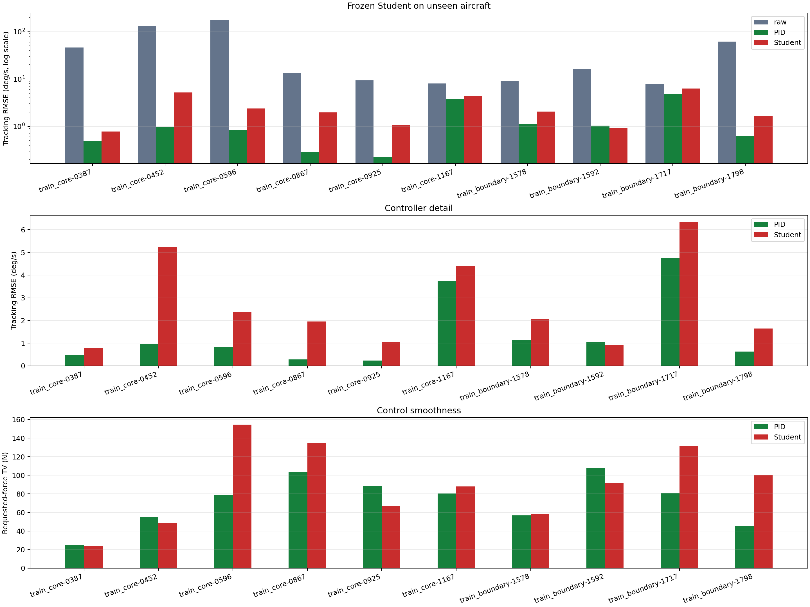

# 冻结 Student 动作限速诊断（2026-08-30）

分支：`experiment/student-driven-v3-20260830`

本实验不训练新网络。它只在 v4 最终 Student 外包一层 requested-force slew limiter，回答一个
具体问题：v4 未通过 Student/Teacher 动作 TV 门，能否仅靠部署限速解决？结论是不能。硬限速
显著降低 TV，但在快速反向指令上引入不可接受的跟踪峰值。

## 1. 冻结对象与实验边界

- Student checkpoint：`540,417` 参数 Dense Student。
- SHA-256：`3c7e545fe7273363c65185355b5ab63f2fd29f7eedb02f5fc91c0b913520e432`。
- plant / policy 步长：`0.001 s / 0.020 s`。
- requested force 范围：`[-22, 22] N`。
- Student 权重在扫描、holdout 和未见机评测前后保持不变。
- 这不是新 Teacher、不是新蒸馏轮次，也不是 PID 后处理。

限速器每个策略步执行：

```text
u_raw = frozen_student(o, theta)
delta_u = clip(u_raw - u_previous, -rate * 0.02, rate * 0.02)
u_limited = clip(u_previous + delta_u, -22 N, 22 N)
```

每个 episode 从 `u_previous = 0` 开始，`rollout_policy` 会调用 `reset()`，不同 episode 不共享
限速器状态。

## 2. 只用训练飞机选择限速值

round-0 蒸馏数据按同 episode 的实际步号差换算 Teacher requested-force 变化率。26 架训练飞机
共有 `214,214` 个合法时间对：

| Teacher 训练动作变化率 | N/s |
| --- | ---: |
| P90 | 6.889 |
| P95 | 11.184 |
| P97.5 | 15.719 |
| P99 | 29.040 |
| 最大值 | 730.180 |

候选取整为 `7/11/16/29 N/s`，并加入环境原 commanded-force 上限 `88 N/s`。选参飞机从 26 架
训练飞机中按 `core/boundary x Level 1/2/3` 分层，每层选择归一化八维 `theta` 空间的 medoid：

```text
boundary: 1488 (L1), 1453 (L2), 1205 (L3)
core:      0750 (L1), 0175 (L2), 0191 (L3)
```

六架蒸馏 validation 飞机在选参阶段完全排除。每架使用全部六条 30 s evaluation 指令，共 36 个
闭环组合。候选必须同时满足均值 RMSE、最大峰值、TV 不增加和 Teacher TV 比门，再在合格候选
中选择 TV 最低者。

| 限速 | RMSE (deg/s) | 最大峰值 (deg/s) | 平均 TV (N) | TV / Teacher | 合格 |
| ---: | ---: | ---: | ---: | ---: | --- |
| 7 N/s | 0.6640 | 6.0592 | **52.44** | 0.577 | 否：峰值 |
| **11 N/s** | **0.6024** | **3.9122** | 65.39 | **0.720** | **是，冻结** |
| 16 N/s | 0.6061 | 3.9260 | 71.89 | 0.791 | 是 |
| 29 N/s | 0.6116 | 3.9260 | 89.45 | 0.984 | 是 |
| 88 N/s | 0.6157 | 3.9260 | 106.10 | 1.168 | 是 |
| 未限速 | 0.6166 | 3.9260 | 107.82 | 1.187 | 基线 |


## 3. 六架 holdout 证伪

冻结 `11 N/s` 后才评测原来的六架整机 holdout，仍使用全部六条 30 s evaluation 指令。没有根据
holdout 结果改选 `16/29/88 N/s`。

| 36 个 holdout 组合 | Teacher | v4 未限速 | v4 + 11 N/s |
| --- | ---: | ---: | ---: |
| 平均 RMSE (deg/s) | 0.7110 | **0.9446** | 1.0357 |
| 最大峰值 (deg/s) | 3.5676 | **4.7569** | 7.9847 |
| 平均 requested-force TV (N) | 117.22 | 249.48 | **67.30** |
| Student / Teacher TV | 1.000 | 2.128 | **0.574** |

硬限速修复了 v4 唯一失败的 TV 比门，但同时使最大峰值门失败：

```text
TV / Teacher <= 1.25: PASS (0.574)
maximum peak <= 5 deg/s: FAIL (7.985 deg/s)
overall: quality_gate_failed
```

失败样本是 `train_boundary-1605 / eval-doublet-15deg-s`。指令快速反向时，限速器必须缓慢把
requested force 从正值穿过零再变负，飞机因制动力来得太晚下冲到约 `-12 deg/s`。未限速 v4
同一组合的峰值仅 `1.00 deg/s`。


## 4. 十架未见飞机

冻结同一个 `11 N/s` 后，在原 10 架零样本飞机和 frozen independent-test-v1 六命令集上复测。
没有目标飞机 Teacher，也没有 Student 适配；PID 仍是逐机专用对照。

| Controller | 平均 RMSE (deg/s) | 最大峰值 (deg/s) | 平均 TV (N) |
| --- | ---: | ---: | ---: |
| Raw | 48.3770 | 849.7530 | 145.65 |
| 逐机 PID | **1.4094** | **21.4604** | **72.20** |
| v4 未限速 | 2.3784 | 47.7420 | 421.65 |
| v4 + 11 N/s | 2.6748 | 47.5851 | 89.84 |

- TV 下降 `331.81 N`，约 `78.7%`。
- 平均 RMSE 上升 `0.2963 deg/s`，约 `12.5%`。
- 相对 Raw 改善率从 `98.33%` 降到 `95.00%`。
- 胜过或追平逐机 PID 的比例不变，仍为 `7/60 = 11.67%`。
- Student/PID RMSE 中位比从 `2.1346` 升到 `2.2540`。



## 5. 结论与下一训练版

这次实验是有效诊断，但 `11 N/s` 不是可发布控制器。它证明 v4 的高 TV 不能用单一固定斜率
上限解决：稳态小误差区需要平滑，doublet/大阶跃的瞬态反转又需要足够动作带宽。

下一版应先保持单一 Dense Student 和现有 `theta` 条件输入，不立即增加 TCN 或 MoE。最小、可
归因的改动是：

1. 把 Student 输出改成相对上一 requested force 的增量动作，而不是每步独立回归完整 `F_as`。
2. 用 stride-1 的连续 episode chunk 训练，禁止 shuffled pair 跨 chunk 破坏时序。
3. 同时匹配 Teacher 的绝对动作和动作增量，并只惩罚超过 Teacher 局部变化率加 margin 的部分；
   Teacher 在指令反转处的必要大动作不会被统一压平。
4. 在 Student-driven 轨迹上做 scheduled rollout / DAgger 标注，使增量策略看到自己的闭环状态。
5. 先过同一 holdout 的 RMSE、峰值和 TV 六项门，再测试未见飞机；若仍有时间一致性问题，再做
   causal TCN/GRU 消融。MoE 只解决跨 `theta` 容量/路由，不应拿来掩盖动作时序问题。

由于这 10 架“未见飞机”已多次参与版本比较，它们现在是固定回归基准，不再是严格盲测集。下一
次声称最终零样本泛化前，应在方法和阈值冻结后从飞机库预注册一组新的 untouched test aircraft。

## 6. 代码与产物

| 路径 | 作用 |
| --- | --- |
| `src/controllers/policy_wrappers.py` | 可重置的 requested-force slew limiter |
| `scripts/55_scan_student_slew_limit.py` | Teacher 变化率统计、训练 medoid 选择、候选扫描 |
| `scripts/56_validate_student_slew_limit.py` | 六架 holdout 原质量门与最坏时域曲线 |
| `scripts/48_evaluate_unseen_student.py` | 增加带 scan provenance 的冻结限速评测 |
| `results/pure_reward_teacher_bank_coverage_v5/slew_limit_training_scan/scan_report.json` | 训练集选择报告 |
| `results/pure_reward_teacher_bank_coverage_v5/slew_limit_holdout_validation/holdout_report.json` | holdout 失败报告 |
| `results/pure_reward_teacher_bank_coverage_v5/unseen_aircraft_slew11/report.json` | 10 架未见机报告 |

三个报告 SHA-256：

```text
scan:    6cf71497712b8d97b050136dad94883d903cf17679ad4f9cf0598d661b916739
holdout: 38e80242edbc9b5a814b973f73406f20610f215f46b2d392a429439cd5ff3f23
unseen:  bf9ff5d4d9dc0edea745edca790bbb275c5eadb45acac85cd21820ec34b1f2ea
```

全套测试 `133 passed, 6 warnings in 23.49 s`；warning 仅来自极小 smoke 数据全零时的 log-scale
绘图，与控制数值无关。新增文件通过 Ruff、`py_compile` 和 `git diff --check`。远端 GPU 端口在
本轮执行时不可达，冻结策略评测使用本机 CPU；这不改变 checkpoint、环境步长、随机种子或闭环
数值合同。
